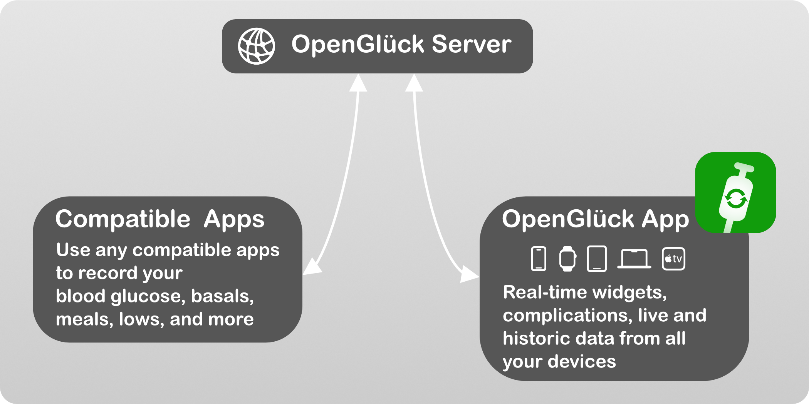

# OpenGlück Server

See [opengluck.com](https://www.opengluck.com/) for an overview of OpenGlück, and how the Server (pictured in top below) integrates with compatible apps:



While the server does not connect to third-party sensors, services or apps by itself, you can use plugins and compatible apps to send new data, or query the
OpenGlück database.

Check out our [companion app](https://github.com/open-gluck/opengluck-ios) for an app that works with your iPhone, Apple Watch, Mac and even Apple TV, packed with widgets and complications.

# Prerequisites

- a server computer or virtual machine, that you can use to run the software (a small cloud server would work)
- some basic knowledge about how to configure an HTTPS proxy (we recommend
  using [CaddyServer](https://caddyserver.com) for a zero-touch configuration
  of LetsEncrypt)

# Install

OpenGlück is available on
[DockerHub](https://hub.docker.com/layers/opengluck/opengluck-server). Perform
the following steps to run an OpenGlück server locally:

## 1. Pull the Docker image

```bash
docker pull opengluck/opengluck-server:latest
docker volume create opengluck-data
docker volume create opengluck-node-modules
```

## 2. Create `.env`

Create an `.env` file at the location of your chosing.

```
TZ=Europe/Paris
NEXT_PUBLIC_APP_URL=https://public-url-of-your-app.example.com
```

See the Environment section for more information about the variables you can configure.

## 3. Run the opengluck server

Run your server with Docker:

```bash
docker run -d --env-file .env \
  -v opengluck-data:/app/data \
  -v opengluck-node-modules:/app/app/node_modules \
  -p 8080:8080 --restart unless-stopped \
  --add-host host.docker.internal:host-gateway \
  opengluck/opengluck-server
```

This will listen on HTTP traffic on port `8080`. This port needs not be open on remote interfaces, see step below.

## 4. Forward HTTPS requests to `opengluck-server`

Use the software of your chosing to listen to HTTPS requests using an SSL certificate. Any certificate, works, you are encouraged to use a free certificate from LetsEncrypt to host your domain.

I am told you can use Caddy like so (replace `example.com` with your domain name):

```
docker run caddy:latest caddy reverse-proxy --from example.com --to localhost:8080
```

## 5. Connect

Connect to your server. The first time you connect, you will be prompted for a username and a password, then you'll get the server home page:


Except when you're integrating with OpenGlück (ie writing your own plugins) or set up webhooks, you'll probably won't need to use the web interface much. (That's part of the reason its layout is quite *simple*, with practically zero CSS.)

# Usage

The OpenGlück server is a *dumb* piece of software, that does not attempt to collect glucose data by itself, or to perform actions when certain conditions occur.

You are free to enable the plug-ins you want, or write your own if you'd like to.

The basic idea is:

1. To inject data to OpenGlück, you use one of the APIs to upload records.
2. To trigger a plug-in when “something” occurs, you need to add a webhook. This is a URL that your plug-ins listen to, typically on `localhost`. When the specific action accurs, OpenGlück calls your plug-in with a JSON payload so you have more context. If required, you can always use APIs to retrieve more data from OpenGlück.

# Concepts

## Webhooks

OpenGlück can be configured to call webhooks when specific events are recorded
(such as a new blood glucose reading). This is a powerful feature -- you can,
for example, write an automation that will turn on your smart lights if you're
having a low at night.

## Logins

You can use multiple users in the OpenGlück server, each user will get its own, separate, data. This is useful if you need to track the records of separate diabetics sharing the same server.

Each login is associated with a token, that you can easily copy from the *API Access* route. 

If you need *follower mode*, then, don't create any additional users, just use the same token for all your users.

## User Data

_User Data_ provides a system for values to be read and written given a key. This can be useful to have plugins share state or communicate.

OpenGlück supports two types of user data:

- key/values, that can get read/set
- lists, to which you can push an item to the front

You can also trigger webhooks when a user data is being set, which provides for a nice way to build cascading effects (beware of _cycles_ though, as OpenGlück will gladly trigger recursive webhooks to no end).

## Webhooks

See [https://github.com/open-gluck/opengluck-server/blob/main/opengluck-server/app/src/features/webhooks.ts](webhook.ts) for the list of webhooks.

Optionally, you can provide a [JMESpath](https://jmespath.org) query to restrict one of your webhook to only when the query matches. This is useful if you're interested in a webhook, but only specific events and not all the times the webhook is triggered.

You can always browse your running OpenGlück server to browse the webhooks, and see the latest payloads associated with each webhooks. This might help you if you're trying to expand on the OpenGlück functionnality to see what's being passed and when.

### `app_request`

This is a list of the requests sent to the server. Think of it as something like an HTTP log.

### `userdata:set`

When a user data has been set.

### `glucose:changed`

When a blood glucose measurement has changed.

### `episode:changed`

When the current episode has changed.

## `glucose:new:historic`

When a new historic blood glucose has been recorded.

### `glucose:new:scan`

When a new scan blood glucose has been recorded.

### `low:new`

When a new low has been recorded.

### `insulin:new`

When a new insulin has been recorded.

### `food:new`

When a new food has been recorded.

## Records

Records are either:

- glucose readings
- insulin (bolus)
- food (for regular meals)
- low (also known as “snacks”)

### Glucose Readings

Glucose readings can be of two type:

- `historic`: these are the records that have been processed by whichever smoothing algorithm your reader is using. These values are not expected to change.
- `scan`: these are the “fresh” records, which might be adjusted in a near future to smooth readings.

### Insulin

Insulin records are always boluses.

### Food

A food record tracks when you have a meal, typically your breakfast, lunch and dinner.

## Low/Snack

A low record is typically used to indicate that you have eaten a snack in response to a low, and indicate how much sugar you ate.

This can be use by clients to visually show your lows and provide visual cues that blood glucose is eventually expected to rise.

## Episodes

An _episode_ is used to convey a state, without providing a blood glucose measurement.

Episodes can be one of:

- `unknown`: when no value is known (can be used when you don't have a sensor)
- `disconnected`: when the sensor is disconnected (e.g. out of reach of Bluetooth)
- `error`: when an error occured
- `low`: when blood glucose is _low_
- `normal`: when blood glucose is in range
- `high`: when blood glucose is _high_

## Instant Glucose Record

An *instant glucose record* is a live measurement from the sensor, before smoothing is applied. It is not used by APIs retrieving current or last data, but can be queried specifically if you need. 

Users need to take special care with instant glucose records, as usual, as it can sometimes show values out of range.

# Environment

In addition to the environment variables accepted by Next, Here is a list of
variables you can configure in your environment:

## `TZ`

The user timezone. Defaults to `UTC`. You can give a format compatible with
[pytz](https://pypi.org/project/pytz/) such as `Europe/Paris`.

## `MERGE_RECORD_LOW_THRESHOLD`

This is optional. When set, then any scan value under this threshold will
trigger the `glucose:changed` webhook.

## `MERGE_RECORD_HIGH_THRESHOLD`

This is optional. When set, then any normal scan value crossing this threshold
will trigger the `glucose:changed` webhook.

# Local Development

## Build Images

Run the following command on the top directory to build the images:

```bash
make build
```

Create your env file at `opengluck-server/.env`.

## Installation

To build the dev environment:

```bash
make build-dev-tools
```

To check style (flake8, black, isort, pydocstyle, pyright, prettier…):

```bash
make lint
```

## Run in Dev Mode

To run both the Python server (with auto-reload) and the Next.js app (in dev
mode):

```bash
make dev
```

Doing so will let you access the front-end using the development port (by default 8080):

http://localhost:8080
